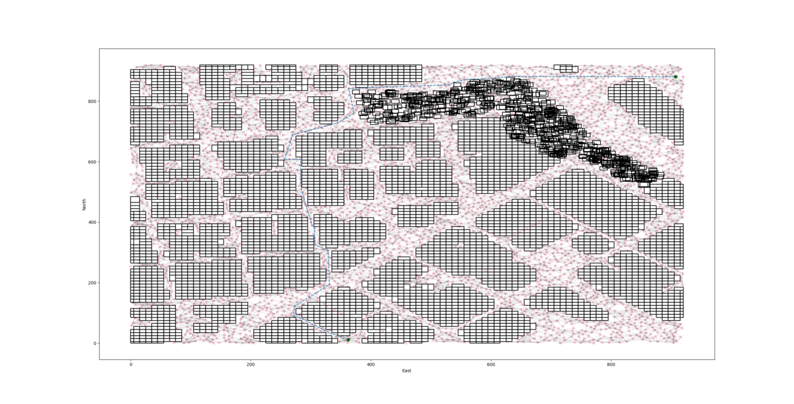

## Project: 3D Motion Planning


---


# Required Steps for a Passing Submission:
1. Load the 2.5D map in the colliders.csv file describing the environment.
2. Discretize the environment into a grid or graph representation.
3. Define the start and goal locations.
4. Perform a search using A* or other search algorithm.
5. Use a collinearity test or ray tracing method (like Bresenham) to remove unnecessary waypoints.
6. Return waypoints in local ECEF coordinates (format for `self.all_waypoints` is [N, E, altitude, heading], where the drone’s start location corresponds to [0, 0, 0, 0].
7. Write it up.
8. Congratulations!  Your Done!

## [Rubric](https://review.udacity.com/#!/rubrics/1534/view) Points
### Here I will consider the rubric points individually and describe how I addressed each point in my implementation.  

---
### Writeup / README

#### 1. Provide a Writeup / README that includes all the rubric points and how you addressed each one.  You can submit your writeup as markdown or pdf.  

You're reading it! Below I describe how I addressed each rubric point and where in my code each point is handled.

### Explain the Starter Code

#### 1. Explain the functionality of what's provided in `motion_planning.py` and `planning_utils.py`
These scripts contain a basic event driven planning implementation which is handled by the class `MotionPlanning`. It derives from `udacidrone.Drone` and it is capable of handling different flight plans as well as taking off, landing, arming and disarming the flying vehicle.
This class will be used to mainly command and control autonomously a drone.

`planning_utils.py` is a collection of helper functions which can be used as the building blocks of a planning algorithm.

### Implementing Your Path Planning Algorithm

#### 1. Set your global home position
In order to find out the coordinates of the origin of our local NED coordinate system, please refer to `colliders.py`.

The class `Colliders` implements a few methods to easily interact with the csv file provided. In order to parse what the 
home latitude and longitude are, please refer to the method called `Colliders.get_reference_lat_lon()`. Here, regex is used in an attempt to be a bit flexible with different headers in the future.

Any header satisfying `re.search('lat0 (.*\d+.\d+.*), lon0 (.*\d+.\d+.*)', first_line)` should produce a result otherwise 
it would raise an error. There are not specific error classes nor error-handling as it is not the scope of this project.


This is picture of San Francisco centered around the colliders `lat0` and `lon0`


#### 2. Set your current local position
Here as long as you successfully determine your local position relative to global home you'll be all set. Explain 
briefly how you accomplished this in your code.

We will set as home the referenced `lat0` and `lon0` (obtained in the previous step) at zero altitude. 
Using this point as reference (or home) we will be able to determine our position relative to this point in the local 
NED system by using the provided `global_to_local` function. 

The code essentially looks like:
```
        # TODO: read lat0, lon0 from colliders into floating point values
        latitude, longitude = self.colliders.get_reference_lat_lon()
        
        # TODO: set home position to (lon0, lat0, 0)
        self.set_home_position(longitude=longitude, latitude=latitude, altitude=0)

        # TODO: retrieve current global position
        global_position = self.global_position

        # TODO: convert to current local position using global_to_local()
        local_position = global_to_local(global_position, self.global_home)
```

#### 3. Set grid start position from local position
In order to transfer local NED coordinates to grid indices, a new function within `planning_utils.py` called 
`local_to_grid_coordinates` as well as `grid_to_local_coordinates` has been created. These methods take care of 
the north/east offsets required to locate the drone within the grid of obstacles. They could be extended to handled 
non-square unit size grids but it is not the scope of this project.

For this example case, the grid start is set to be the home location.

#### 4. Set grid goal position from geodetic coords
Once more, using `global_to_local` as well as the newly implemented `local_to_grid_coordinates` it is possible to find out 
what the goal location is in grid indices. We have now got a grid of obstacles and the start and end locations in grid coordinates.

#### 5.A. Modify A* to include diagonal motion (or replace A* altogether)
Minimal requirement here is to modify the code in planning_utils() to update the A* implementation to include diagonal motions on the grid that have a cost of sqrt(2), but more creative solutions are welcome. Explain the code you used to accomplish this step.
In order to handle diagonal motion, the class `Action` has been extended with new actions such as NORTH_EAST, NORTH_WEST etc..

They are now looking like. Note that I avoided calling sqrt(2) but no significant speed improvement is noted.
```
class Action(Enum):
...
    NORTH_EAST = (-1, +1, 1.41421356237)  #1.41421356237 = sqrt(2)
...
```

Also, a new static method has been included within `Action` in order to "add" actions and/or nodes as shown below 
```
    @staticmethod
    def add(tuple1, tuple2):
        return tuple1[0] + tuple2[0], tuple1[1] + tuple2[1]
```

Last but not least, `valid_actions` is modified in order to handle not only the new actions but any action we wish to implement.
The final implementation iterates over all actions and checks whether an obstacles restricts the action or the grid size.

```
def valid_actions(grid, current_node):
...
    for action in Action:
        i, j = Action.add(action.delta, current_node)
        if not (0 <= i < n and 0 <= j < m and grid[i, j] == 0):
            valid_actions.remove(action)
```
Notice that the order of the conditions matters as `grid[i,j]` could not be evaluated if the preceding conditions are not matched.

#### 5.B Search Implementation
In order to speed-up the planning problem, I explored the proposed random sampling technique explained in the lessons. 
However it is not always perfect and it trades subsampling speed with a requirement for a higher number of KDTree searches when trying to connect edges

I thought what could be the ideal subsampled grid, hence I implemented `cluster_grid_sampling` (includded in `planning_utils.py`) using 
`sklearn.clusters.MiniBatchKMeans`. It produces a really good distribution but unfortunately it a bit slow.

An intermediate solution between KMeans Clustering and random sampling is implemented in `subsample_grid` (included in `planning_utils.py`)
Which is what is used in the final implementation. It creates random grid indices and then checks the proximity to previously created grid indices using integer arithmetic only.
It also checks whether or not the indices belong to a cell that contains an obstacle. 

```
def subsample_grid(grid, min_distance, max_iter=None, seed=0, max_points=1E4):
```

It is significantly faster than `MiniBatchKMeans` and covers the grid considerably better than random sampling.
This points are then added to a `networks` Graph. Finally, A* search is performed on this graph.

#### 6. Cull waypoints 
Although I have implemented `prune_collinear_points` within `planning_utils.py`, I am happier with the results of something I called "line_of_sigth_smoothing"
It is a simple algorithm that mainly avoids unnecessary zigzagging. 

1) For three points, it checks (employing bresenham algorithm) if the 3rd can be reached from the first one without crashing with an obstacle.
2) If 1-3 route is possible, removes the point in the middle
3) if the greedy mode is passed as True (default is False), it restarts the algorithm from the starting node of the path otherwise it continues traversing the path


### Execute the flight
#### 1. Does it work?
It works! I have been able to fly from multiple origins to multiple targets successfully. It is so nice to see this working nicely 

I have noticed that the time of execution of the algorithm is faster when running the stand-alone script `route_plan_debugger.py` 
than within `motion_planning.py` 

Below there is a picture of the grid subsampling, graph edges and final route plan after "line_of_sight_smoothing"
As you can see, there are no nodes of the graph that are almost overlapping on top of each other. 


